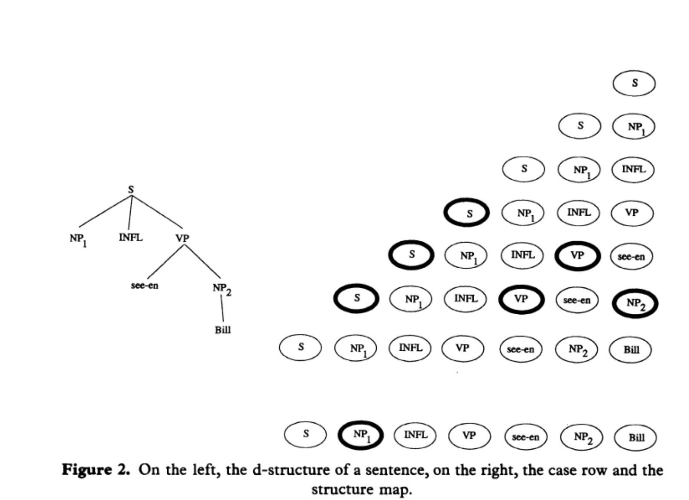

# What Is Modern Natural Language Processing About? 

\toc

To answer this major question, it's important to draw inference from some of the important concepts in psychology. The first one is _The Language of Thought Hypothesis_ and the second one _The Representational Theory Of Mind_. The first one touches on the importance of how our brain has a schema when it comes to producing language of thought, or called _Mentalese_. The _Representational Theory of Mind_ on the other hand touches on our cognitive abilities to be able to have volition manifested in natural language through propositional attitudes. The schema goes as,

> X believes that p iff X believes that S which is a mental representation and p is the actual manifestation of S. 


That being said, the language that we used to describe our mental experience is only a representation of what in actuality the thing is inside our brain. This representation could bear a semantic property, be it a denotation or a truth-condition.

    
### What Does It Mean To Have A Mental Language?

Continuing the discussion LOTH or the _The Language Of Thought Hypothesis_, again one can postulate that it's closely correlated with the mental representation (drawing reference from  _the representational theory of mind_), and also as per the context of current discussions around understanding how the brain actually works (at least w.r.t the folk psychology) it confirms that _Mentalese_ exists within the scope of research. These "mental representations" are called propositional attitudes and borne out in the form of a natural language as beliefs, desires, intentions, and fears. 

The exactness of a mental language or a mental state is yet unknown. However, in folk psychology, these propositional attitudes are a direct reflection and serve a distinctive function to these mental images, in case the locutionary intends that the proposition A* gets assign to these mental states S. This might be fundamental for inferential reasoning, assuming the importance of how it's tied to relevant actions. The mental representations S here are put into "boxes" (a "belief box" or a "desire box"). That being said,

> Someone who *believes* S stands in a psychologically important relation to the proposition expressed by S. 

Another important point to bring up here pertaining to the discussion of systematically theorizing the representational theory of mind or what constitutes as a mental language is that token-and-type has to come into play. To be more specific,

> the type is the mental representation itself (repeatable), and the tokens are reflected as the mental events or could be neurological. And thought processes are casual sequences of tokenings of mental representations.

So, to talk about the actualization of a mental image in such case, the process goes as,

@@colbox-blue
First, the occurrence where I have an intention of doing something; 
And then second the enduring state which is reflected as my long standing belief of something. 
With deductive reasoning and inference (I transition from believing* the premises to believing the conclusion) together as a package, I postulate the RTT or the representational theory of mind. And the propositional attitudes reflect these mental images which are the direct objects and constitute the scope of a thought process. 
@@

However, it's also brought to attention that according to discussion, RTT requires qualification, meaning it needs context to be thoroughly discussed. Put simply, the mind could postulate an infinite amount of thoughts, but the important ones are qualified or vetted through propositional attitudes that are able to have an effect. Or intentional causation could only come about where there's an explicit representation.

@@colbox-blue
In a nutshell, to discuss in more seriousness, it's important to distinguish sharply between mental representations and rules governing the manipulation of mental representations. Similarly applicable to deductive reasoning where we often follow rules of deductive inference without explicitly representing the rules. Or we often as native speakers of a language follow its inherent syntax without explicitly stating the rules that govern it.  
@@

### How Are Above Premises Important To Our Discussions of Current Natural Language Processing Research? 

Natural languages are compositional meaning that complex sentences are formed through simple linguistic expressions. In the same light, a mental language could be compositional and consist of symbols amenable to semantic analysis. This would be introduced as the COMP or _The Compositionality of Mental Processes_. 

LOT claims that mental states typically have constiuent structures. That said, the mental state of intending something bears weight and complexity on its own not including their propositional objects or mental representations. Combined together the RTT + COMP builds the foundation for LOTH.  

Ancient LOT proponents used syllogism and propositional logic to analyze the semantics of _Mentalese_. Current researchers instead use predicate calculus, which was established in the late 18th century and optimized in the 30s. The premise was that,

> Mentalese contains primitive words - including predicates, singular terms, and logical connectives - and these words combine to form complex sentences governed by something like the semantics of the predicate calculus.


Logical structure only constitutes partly the complex representations, accompanied with other non-sentential formats including graphs, maps, diagrams, etc. They could also be manifested as ideas and imagistic forms. In fact, logic plays no role in such constructions only loosely connected structures did. Schematic mental maps in relation to actual concrete maps best describe these kinds of mental images and representations. Therefore, pluralism was adopted by some to analyze thoughts, including but not limited to logical structure, analogous images, maps, and diagrams, etc. 

However illogical these perceptual mental representations are compositional and complex. They also display systematicity. Supporters of LOT will posit that _The Computational Theory of Mind_ serves to produce the language of thought. Together RTT + COMP + CCTM (The Representational Theory of Mind, The Compositionality of Mental Processes, and The Classical Computational Theory of Mind) forges the LOTH.  And our cognitive inferential systematicities provide the space for the above hypothesis to stand. However, the system considers only the syntactic importance without the presence of semantic significance. 

In the modern era, CCTM is however excluded in the discussion. only RTT + COMP is included. This is the original spawning of a new school of computational theory of mind grounded in connectionism. 

### Deep Learning and Neural Networks Continued

Now we could finally come back to discuss deep learning and the neural network models. In the 1980s, connectionism gained traction as an alternative to the Turing style computational model. The idea is that instead of treating the mental states as having memory access locations with a central processor and a bunch of strings and symbols ready to be manipulated, the connectionist approach treats them as more primitive. That said, under such condition, there are activations of neurons or so called "weight units" distributed and connected across the system, functioning analogously to the real synapses to our brain. 

These newer and modern systems were built in hope that they could emulate the actual brain activity and could appreciate that

> brain states are representational, so a good explanatory model should be able to capture that; second, thought processes are productive and systematic, which is manifested in the ability to conduct inferential reasoning.

To accept this position, connectionism has to accept RTT + COMP. Eliminativist connectionists might completely reject this position, and on the other hand implementationist connectionism might accept it in order to endorse the Turing style computational model. 

Some literature later has spawned up around it, debating around the necessity of the commitment to productivity and systematicity of thoughts. Supporters still seek to illuminate the traditional style of computational system. However, objections in entirety go against  the need of adopting the representational theory. Another stream of objections go against the fact that the productivity and systematicity nature of language of though have been greatly exaggerated. The last objections posit that one can still create models that reflect the compositionality and the internal structures without adopting the Turing style model.

The connectionists contend that instead of a concatenated structure, distributed representations could well capture the integral parts of LOT. However, doubt was raised around the idea that if we consider concatenative constituency structure is only one of the realizations of the _productivity_ and _systematicity_ of the LOT, then these schools of neural models would still be considered as part of the classical. 

> broadly speaking, classicists would appreciate the structural representations while the connectionists would appreciate the more distributed representations. 

#### Naturalizing Intentionality Through HF Over Natural Language _Learning_ vs _Understanding_

This part of the discussion is very important as it's pertaining to the origins and departures of these two schools of LOTH: rationalism vs empiricism or the classism vs the connectionism. 
The argument ties back to researches conducted around _concept acquisition_, and the innateness of toddlers to be able to adopt new things into their _Mentalese_. The hypothesis formulation and model testing done around the argument has suffered two logic fallacies: _ad infinitum_ and _the pain of circularity_, as children could not possibly develop a meta-meta-language to explain a meta-language nor could they have the ability to represent something unless the concept is already known, which is through the required inductive reasoning in a hypothesis formulation about the denotation of _Mentalese_. Therefore, it bears that there's no such thing as concept learning. And the conclusion was that concepts are unlearned in fact they are innate. 

In such a case, it's very important to explain what it means by understanding a natural language?  The conclusion was that,

@@colbox-blue
a Mentalese is a direct medium of the thought process and not the object of interpretation, as we face the conundrum of having to represent it through a meta-language which suffers the logic fallacy of ad infinitum; put differently, "we face the infinite regress of a meta-language". Therefore, it's not perceived or interpreted. One cannot say that they understood the mental language the same way as they understood a natural language. 
@@

similarly to words (lexical items in a natural language), we can hardly define what a primitive expression's semantic properties exactly are. Though it's easy to illustrate the relations between complex expressions formed from these primitive expressions, researchers sought to create paradigms that could well capture the semantic properties of them. Here the strategy was to adopt functionalism (where _mind is the functional organization of the brain_). Therefore,  the effort of categorizing what exactly it means by saying "X A's that p iff there is a mental representation S such that X bears A* to S and S means that P" gets broken down into two steps,

```
1. to explain in naturalistically acceptable terms what it is to bear psychological relation A* to mental representation S.
2. to explain in naturalistically acceptable terms what it is for mental representation S to mean that p.
```

By treating these mental processes as type-token relations, we are able to provide a solution. 

> e and e* are tokens of the same _Mentalese_ type iff R(e,e*). And individuated in neurological terms it becomes that e and e* are the tokens of the same primitive Mentalese type iff  e and e* are tokens of the same neural type. 

This is the process of naturalizing intentionality and individuating it through pure neurology. However above schema faces a challenge as it could not address the issue of _multiple realizability_, as it is defined heterogeneously in the realm of neuroscience, physics, and biology. In lieu of which, a functional definition is carried out and goes as,

> e and e* are tokens of the same primitive Mentalese type iff e and e* have the same functional role. 

**The below strategy gains popularity as it facilitates the Turing style model treating mental processes as a "computational role" subscribing the "functional role" to Turing style computationalism formalism. And there are two categories that represent such a "functional role": molecular and holist.**

Molecular theory treats separately the relations borne out between symbols; on the other hand, the holist theory is more fine-grained. In other words,

> e and e* belong to the same primitive Mentalese type iff they have the same (canonical if adopted) functional role under MT and iff they have the same total functional role under HT.

To explain in simpler terms as I understood it, looking at a natural language say we have the simple term _word_ and _words_ in English serving as a basic unit or lexical item; they would belong to the same primitive type WORD as the same token under MT and different under HT. However it's concerned under HT that it might violate the _publicity constraint_ as propositional attitudes are shareable. And in contemporary literature through the inferential judgement that in a natural language, there's a vague and arbitrary sense of denotation (The English word "cat" denotes cats, but could denote something had the linguistic convention presumes so), one can also conclude that in a _Mentalese_, such a case is applicable.  

Yet, historical literature suggests an alternative view that addresses an distinction that _Mentalese_ is essentially semantically permeated meaning that they are not arbitrary as a natural language is and at least to some extent they have a fixed denotation. This view is confirmed by the fact that different from a natural language, their intrinsic attribute is schematic and typical, meaning that they are types (if one may ask what ensures such a fixed position?) Therefore, CAT in a _Mentalese_ would have denoted cat by its inherent nature and this _semantically permeated approach_ adopts a classificatory scheme that allows the tokens getting categorized adopt semantic values. Finally, the denotation individuation approach goes as,


> e and e* are the same primitive types iff they bear the same denotation. 

However, this approach also faces some challenge. First, it violates the original LOTH's aim to naturalize intentionality in non-representational computational models, as this approach does not take into account the formal-syntactic types manipulated during mental computation (carried out in the FSC's provided explanation of semantic integrity). On top of it, this approach merely prevents the formal-syntactic _Mentalese_ types while executing a reduction in naturalization of intentionality. 

In a nutshell, above individuation theories might not be adequate to account for the entirety of LOTH. More investigation is needed. 

#### How Are The Above Premises Important to Establishing the Framework of Natural Language Understanding? 

To answer this question, we might need to discuss the important researches done in the realm of cognitive linguistics. As we have mentioned in previous paragraphs of the scientists endeavor to address the issues with representing a _Mentales_ in the realm of cognitive science. In the same light, around the 90s emerging researches under the name _Connection Science_ has sparked a unique route to pointing issues on representation in a natural language (e.g. distributed vs. localist representations, classical vs. uniquely connectionist representation, type/token vs. part/whole hierarchies). This section will also bring up principles and ideas in the Chomskyan Transformation Grammar Theory; we now may call it TG. The importance is that natural language modeling and understanding tasks often want to seek solutions that extract the underlying complex syntactic structure of a natural language. And oftentimes at least in _Connection Science_ this is done through a more generally functionalism approach, which we will get into more detail later.

In order to capture more complex syntactic structures that lie in a natural language sentence, the researchers of LOTH have put a great deal of effort in developing distributed representational models with endowment of some kind of compositionality abide to the COMP law (the Compositionality of Mental Processes).  

##### A simple introduction to the TG Theory and GB Law

_Deep vs. Surface Phrasal Structure_ - below is an example of a "passive transformation" changing a phrase's deep structure by moving the phrase's noun phrase from object position to subject position. For example,


> a. d-structure: [$_{NP}$] INFL see-en BILL

> b. s-structure: Bill INFL seen-en e


Here the letter _e_ represents the empty category that fulfills the empty category principle constraint


_Government Binding_ - essentially what we see in above example is that in GB there are two phases in generation:

```
1. will still require the phrase structure rules. 
2. the change from d-structure to s-structure.
```

_The Empty Category Principle_ - which is the constraint that whenever there's an empty category left behind by some sort of motion forced by case-filtering needs to be properly governed. 


_D-Structure_ - the d-structure is the product of phrasal structural rules that are derived from X-bar syntax, which provides a template for the structure of phrases (NP, VP, etc). 


_Case Filtering_ - Case is a grammatical marking which is assigned to phrase with specific structural relationships to various lexical items, such as verbs. 


_The $\theta$-Role_ - similar constraint is the $\theta$-criterion. In addition to case, a verb assigns some $\theta$-roles ('thematic roles' such as agent, patient, goal). The $\theta$-criterion says that a chain must have one and only one $\theta$-role attached to it. 


_Movement-$\alpha$_ - During transformation, the d-structure turns into the s-structure which reflects (more or less) the actual form of the generated sentence. This movement is constrained by restrictions on the positions, items moved, and other properties of a chain. This is very crucial to pay attention to if a language modeling task needs to done addressing such a movement. 

Why is this important to bring up here? As I have understood it, this is exactly a functionalism reductionism approach of mapping a natural language, in the sense that the constituent parts of an entire phrasal structure is the simpler reduction of the entire sentence as a whole. Together under the Chomskyan schema below, we are able to produce and map sentences with ease,


#### Addressing The Issues with Non-Autonomy of Syntax


##### A connectionist approach to addressing these constraints with a non-overlapping mapping mechanism 



This is an important introduction to bridging these two different schools of LOTH theory development. At a simpler level, a breath-first representation as a mapping was provided to capture the d-structure of a phrasal structure to a row and column representation with constituent parts highlighted (where the constituents preceding a constituent form the elements of the column above it as demonstrated in the graph above). This mapping also needs to satisfy the above constraints, which we will go into more depth in the subsequent sections.

In fact, a few papers accomplished in the 1980s put effort into addressing this compositionality through coding the syntactic elements of the inputs at a higher level with a simple MLP neural network to train such a model and accomplish subsequent lower level parsing tasks.  
 

#### Distributed Representation To Map Syntactic 


#### Transformers and Self-Attention Mechanism 

