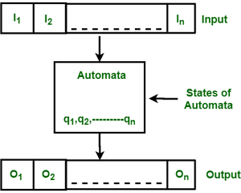

# Finite state machine and automata

The simplest machine to recognize patterns is a finite automaton (FA). As in /baa+!/, it is used to describe a Regular Language.
Additionally, it is employed to identify and analyze Natural Language Expressions. The abstract machine known as the finite automata or finite state machine has five components, or tuples. It has a number of states and a set of guidelines for changing between them, but these depend on the input symbol used. The input string can be accepted or rejected depending on the states and the set of rules. In essence, it is a model of an abstract digital computer that reads an input string and modifies its internal state according to the current input symbol. 





The above figure shows the following features of automata:

    Input
    Output
    States of automata
    State relation
    Output relation
    A Finite Automata consists of the following: 


    ```
        Q : Finite set of states.
        Σ : set of Input Symbols.
        q : Initial state.
        F : set of Final States.
        δ : Transition Function.
    ```


    Formal specification of machine is 

    ```
    { Q, Σ, q, F, δ }

    ```


    1) Deterministic Finite Automata (DFA):


    ```
    DFA consists of 5 tuples {Q, Σ, q, F, δ}. 
    Q : set of all states.
    Σ : set of input symbols. ( Symbols which machine takes as input )
    q : Initial state. ( Starting state of a machine )
    F : set of final state.
    δ : Transition Function, defined as δ : Q X Σ --> Q.
        
    ```

    In a DFA, the machine only enters one state for a specific input character. For every input symbol, a transition function is defined for each state. Additionally, DFA does not support null (or) moves, meaning that it cannot change its state without an input character. 

    Create a DFA that, for instance, only accepts strings that end in 'a'.
        Assumed: Σ = {a,b}, q = {q0}, F={q1}, Q = {q0, q1}
    If you want to create a state transition diagram that is accurate, you should first take into account a language set of all the potential acceptable strings.
        L = {a, a, a, a, a, aa, aaa, aaaa, ba, bba, bbbaa, aba, abba, aaba, abaa}
    The list above is just a small portion of all possible acceptable strings; there are many other strings that contain the letters "a" and "b."